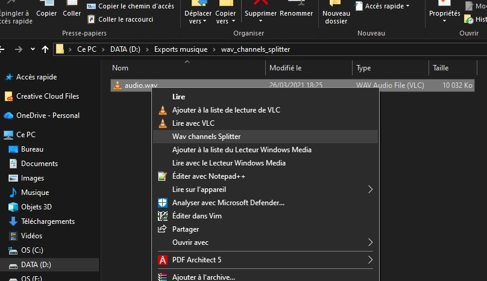
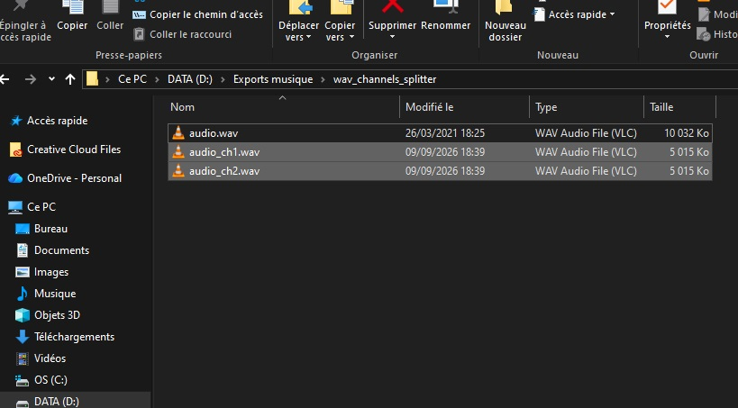

# wav_channels_splitter

`wav_channels_splitter` is a small C++20 utility designed to **split the audio channels of a multichannel WAV file**.

For each channel of the source file, the program creates a new mono WAV file containing only the samples from that channel.

The project provides two separate implementations to make compilation on **Linux** and **Windows** easier.

## Demonstration

### Before



### After



## How it works

Starting with a file such as:

```text
music.wav
```

if it contains 4 channels, the program generates:

```text
music_ch1.wav
music_ch2.wav
music_ch3.wav
music_ch4.wav
```

The generated files are placed in the **same directory as the source file**.

The program preserves the main audio characteristics of the source file:

- sample rate;
- bit depth (`bits per sample`);
- supported PCM or IEEE float audio format;
- the number of samples corresponding to each channel.

Each output file is written as a **mono** WAV file.

---

## Project structure

The project is organized as follows:

```text
wav_channels_splitter/

├── linux_srcs/
│   ├── main.cpp
│   ├── Wav.cpp
│   └── Wav.hpp
│
├── windows_srcs/
│   ├── main.cpp
│   ├── Wav.cpp
│   └── Wav.hpp
│
├── bin/
│   ├── wav_channels_splitter
│   └── wav_channels_splitter.exe
│
├── Makefile
├── install_wav_channels_splitter.reg
└── README.md
```

The Linux and Windows versions use different entry points and path handling:

- Linux uses `main(int argc, char **argv)` and `std::string`.
- Windows uses `wmain(int argc, wchar_t **argv)` and `std::filesystem::path`, especially to handle paths containing Unicode characters more reliably.

---

## Requirements

The project already includes **two precompiled standalone binaries** in the `bin` directory that can be used directly.

Linux:

```text
wav_channels_splitter
```

Windows:

```text
wav_channels_splitter.exe
```

However, if you want to compile the project yourself, additional requirements are needed.

### Linux

The project requires:

- a C++ compiler compatible with C++20;
- `g++`;
- `make`.

For example, on Debian/Ubuntu:

```bash
sudo apt install g++ make
```

### Windows

To compile the Windows version from Linux, the project uses the MinGW-w64 compiler:

```text
x86_64-w64-mingw32-g++
```

The Makefile is configured to produce a statically linked Windows executable.

---

## Compilation

### Linux

From the project root:

```bash
make
```

The generated executable is:

```text
bin/wav_channels_splitter
```

To remove object files:

```bash
make clean
```

To remove object files and executables:

```bash
make fclean
```

To clean everything and rebuild:

```bash
make re
```

### Windows from Linux

The Makefile provides a dedicated target:

```bash
make windows
```

It generates:

```text
bin/wav_channels_splitter.exe
```

The compilation uses, among others:

```text
-static
-static-libgcc
-static-libstdc++
```

to reduce the runtime dependencies required by the Windows executable.

---

## Usage on Linux

The program expects exactly **one argument**: the path to the WAV file to process.

Example:

```bash
./bin/wav_channels_splitter /home/user/audio/music.wav
```

Or from the current directory:

```bash
./bin/wav_channels_splitter music.wav
```

The program checks that:

1. the path exists;
2. the path points to a regular file;
3. the extension is `.wav`.

If the file is valid, the program reads its WAV header, loads the audio data, and creates one mono file per channel.

---

## Usage on Windows

The executable can be launched from a terminal:

```text
wav_channels_splitter.exe "C:\Users\User\Music\music.wav"
```

Quotes are recommended when the path contains spaces.

Example:

```text
wav_channels_splitter.exe "C:\Users\User\Music\My Audio\music.wav"
```

The Windows version uses `wmain` and `std::filesystem::path` to correctly handle Windows paths, including paths containing non-ASCII characters.

---

## Windows right-click integration

The project also includes a `.reg` file that adds an entry to the context menu of `.wav` files.

The file is based on the following registry key:

```text
HKEY_CURRENT_USER\Software\Classes\SystemFileAssociations\.wav\shell\WavChannelsSplitter
```

The entry then appears in the context menu of a WAV file under the name:

```text
Wav channels Splitter
```

When selected, Windows launches the program and passes the selected file as an argument.

### Example `.reg` configuration

```reg
Windows Registry Editor Version 5.00

[HKEY_CURRENT_USER\Software\Classes\SystemFileAssociations\.wav\shell\WavChannelsSplitter]
@="Wav channels Splitter"

[HKEY_CURRENT_USER\Software\Classes\SystemFileAssociations\.wav\shell\WavChannelsSplitter\command]
@="\"C:\\Program Files\\WavChannelsSplitter\\wav_channels_splitter.exe\" \"%1\""
```

### Important

The path specified in the `.reg` file must match the actual location of the executable.

In the example above, Windows will look for:

```text
C:\Program Files\WavChannelsSplitter\wav_channels_splitter.exe
```

The `.reg` file **does not install the program automatically** and does not copy the executable. It only adds the corresponding entry to the Windows Registry.

After placing the executable at the desired location, the `.reg` file can be run to register the context-menu entry.

---

## Supported WAV formats

The program parses standard RIFF/WAVE chunks and specifically looks for:

- `fmt `: audio format information;
- `data`: audio sample data.

The formats recognized by the program are:

| WAV format | Bits per sample |
|---|---:|
| PCM | 8 bits |
| PCM | 16 bits |
| PCM | 24 bits |
| PCM | 32 bits |
| IEEE float | 32 bits |
| IEEE float | 64 bits |

The program checks for the following signatures:

```text
RIFF
WAVE
```

Unknown chunks are skipped while reading, allowing the program to process WAV files containing additional RIFF chunks.

---

## Channel splitting principle

In an interleaved PCM or float WAV file, samples are stored successively by frame.

For example, for a stereo file:

```text
L R L R L R L R ...
```

The program iterates through each frame and extracts the sample corresponding to the requested channel.

For a stereo file:

```text
source.wav
   │
   ├── channel 1 ──> source_ch1.wav
   │
   └── channel 2 ──> source_ch2.wav
```

For a multichannel file, the same principle is used, with one output file created for each channel.

---

## Generated file names

The input file name is used as the output prefix.

For example:

```text
D:\Audio\surround_test.wav
```

will produce:

```text
D:\Audio\surround_test_ch1.wav
D:\Audio\surround_test_ch2.wav
D:\Audio\surround_test_ch3.wav
D:\Audio\surround_test_ch4.wav
D:\Audio\surround_test_ch5.wav
D:\Audio\surround_test_ch6.wav
```

---

## Mono files

If the source file contains only one channel, no splitting is performed.

```text
channels <= 1
```

The program simply returns from the splitting function without creating any additional files.

---

## Error handling

The program reports, among others, the following errors:

- file does not exist;
- path does not point to a regular file;
- file extension is not `.wav`;
- file cannot be opened;
- invalid RIFF/WAVE signature;
- invalid `fmt ` chunk;
- error while reading audio data;
- error while creating or writing an output file.

Errors encountered during processing are caught in `main` and printed to the console.

---

## Current limitations

The program is intentionally simple and focuses on channel separation.

Current limitations include:

- non-`.wav` files are rejected;
- the program expects a single input file;
- output files are always created in the same directory as the source file;
- metadata and additional chunks from the source file are not copied to the output files;
- the output is rebuilt using a standard 16-byte `fmt ` chunk;
- mono files do not produce additional files;
- WAV formats that are not recognized are not explicitly rejected before processing, although their format remains marked as `UNKNOWN`.
